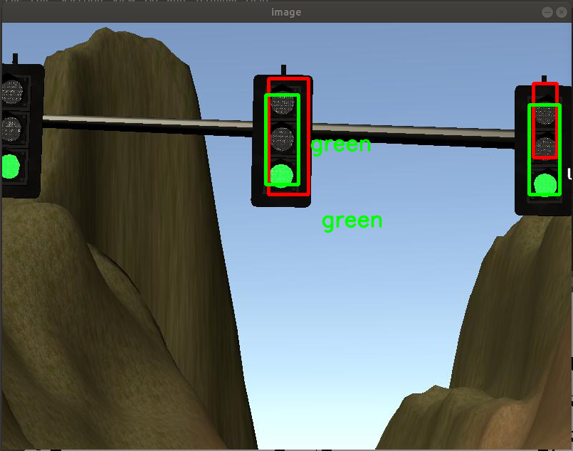

[//]: # (Image References)

[architecture]: ./output_imgs/capstone_project_arch.png "Architecture"
[tldetector]: ./output_imgs/tl_detector_node.png "TL Detector"
[waypoint]: ./output_imgs/waypoint_updater_node.png "Waypoint Updater"
[dbw]: ./output_imgs/dbw_node.png "Drive-By-Wire"
[simulator]: ./output_imgs/simulator.png "Simulator"
[tl_classifier]: ./output_imgs/tl_classifier.png "TL Clasiffier"
[tl_img_proc]: ./output_imgs/tl_image_processing.png "TL Image Processing"
[sim_result]: ./output_imgs/sim_result.gif "Simulation result at traffic light"
# **Capstone Project** 
## Report

---

**Capstone Project**
![alt text][simulator]
# Overview
The goal of this project is the implementation of ROS nodes for an autonomus vehicle. One of the node will include a classifier for traffic lights, and the SW will stop the vehicle in case of a red one. This project is focused to System Integration with a vehicle simulator.  

## Prerequisites
This project involves the System Integration Simulator which contains the Capstone Project from the [releases tab](https://github.com/udacity/CarND-Capstone/releases).

## Running the Code
* Simulator. You can download these from the [project intro page](https://github.com/udacity/CarND-Capstone/releases) in the classroom.

Please refer to [README.md] in order to run the project.

# Introduction
Carla vehicle uses waypoint navigation to drive on autonomously while avoiding obstacles and detecting/classifying traffic lights to stop at given stoplines' indices. Waypoints are used by Carla to do its path planning. Each waypoint has a target velocity based on the vehicle's intended behavior. The Carla's system consists of 3 main modules.

1. **Perception**
   
    a. Traffic Light Detection/Classification

    b. Obstacle Detection

2. **Planning**
   
   Waypoint Updater and the associated target velocities

3. **Control**

   Drive-By-Wire Node / Twist Controller: Controlling the vehicle's behaviour by actuating throttle, steering and brake to navigate the waypoints with the target velocity.

An overview of the complete system architecture is shown below

![alt text][architecture]
    
## Perception

### Traffic Light Detection / Classification
![alt text][tldetector]

|Topic | Info |
|--- | --- |
|/traffic_waypoint | index of the waypoint for nearest upcoming red light's stop line|
|/current_pose| Provides the current position|
|/base_waypoints| list of waypoints the car will be following|
|/image_color |image stream from the car's camera|
|/vehicle/traffic_lights | (x, y, z) coordinates of all traffic light|

This node is responsible for detecting upcoming traffic lights on the way, and classifying them based on their current state (red, yellow, green, unknown).

At first, the design intention was to use DeepLearning technique for traffic light classification. However, I could not find a compatbile Tensorflow version which was able to integrate with current system. I had spent almost 2 weeks to look for a right version of Tensorflow, but could not get a chance of success. Therefore, the traffic classification is developed based on openCV algorithm (Canny, HoughlinesP and findContours functions). 

| Canny/Hough Transform                   | Traffic Light classification                | 
| --------------------------------------- | ------------------------------------------- |
|  |  |

Image Processing function is implemented in `tl_classifier.py` module.

## Planning

### Waypoint Updater
![alt text][waypoint]
|Topic | Info |Type|
|--- | --- |--|
|/final_waypoint |list of waypoints ahead of the car with target velocities |styx_msgs/Lane|
|/obstacle_waypoint |  location to stop for obstacle|
|/traffic_waypoint | location to stop for red light|
|/current_pose| Provides the current position| geometry_msgs/PoseStamped|
|/base_waypoints| list of waypoints the car will be following provided by a static .csv file|	styx_msgs/Lane |

The purpose of this node is to update the associated target velocity of each waypoint defined in the whole waypoints list based on the state of the upcoming traffic light and the obstacle detection (which is not implemented). This node will subscribe to the /base_waypoints, /current_pose, /obstacle_waypoint, and /traffic_waypoint topics, and publishes in the end a list of waypoints ahead of the vehicle with associated velocites to /final_wayponts topic.

## Control

### Drive-By-Wire Node / Twist Controller
![alt text][dbw]
|Topic | Info |
|--- | --- |
|/current_velocity and /twist_cmd| target linear and angular velocity|
|/vehicle/dbw_enabled| car control under dbw or manual|

The purpose of this node to calculate the throttle, brake and steering commands and publish them to the vehicle.

#### Drive-By-Wire Node
Carla is equipped with a drive-by-wire (dbw) system, meaning the throttle, brake, and steering have electronic control. The dbw_node subscribes to the /current_velocity topic along with the /twist_cmd topic to receive target linear and angular velocities. Additionally, this node will subscribe to /vehicle/dbw_enabled, which indicates if the car is under dbw or driver control. This node will publish throttle, brake, and steering commands to the /vehicle/throttle_cmd, /vehicle/brake_cmd, and /vehicle/steering_cmd topics.

#### Twist Controller
The controller's main task is to control acceleration and steering values. The acceleration is controlled via a [PID Controller] at `./ros/src/twist_controller/pid.py` module, while the steering is calculated via a [Yaw Controller] at `/ros/src/twist_controller/yaw_controller.py` module which calculates the needed angle to maintain the required velocity.

# Results Evaluation and Success Criteria

1. **The code is built successfully and connects to the simulator.**: By running `catkin_make`, `source devel/setup.sh` and `roslaunch launch/styx.launch` within the ros directory results in no errors and allows the program to connect to the simulator

2. **Waypoints are published to plan Carla’s route around the track.**: Waypoints are published to `/final_waypoints` to plan the vehicle’s path around the track. No unnecessary moves (excessive lane changes, unnecessary turning, unprompted stops) are occurring. As in the Path Planning project, acceleration does not exceed 10 m/s^2 and jerk should not exceed 10 m/s^3.

3. **Controller commands are published to operate Carla’s throttle, brake, and steering.**: `dbw_node.py` has been implemented to calculate and provide appropriate throttle, brake, and steering commands. The commands are published to `/vehicle/throttle_cmd`, `/vehicle/brake_cmd` and `/vehicle/steering_cmd`, as applicable.
   
4. **Successfully navigate the full track more than once.**: The vehicle is able to complete more than one full loop of the track without running off road or any other navigational issues (incorrect turns, random stops, teleportation, etc.).
   
The system was tested only on the simulator.

## Simulation

![alt text][sim_result]